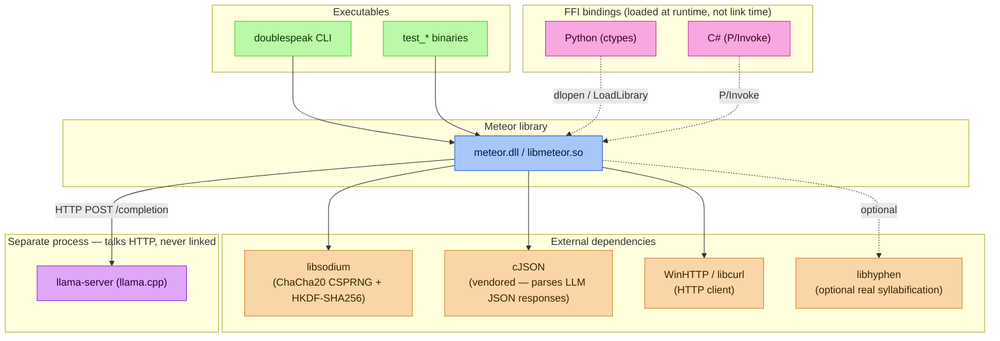
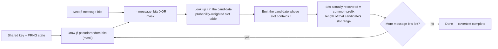
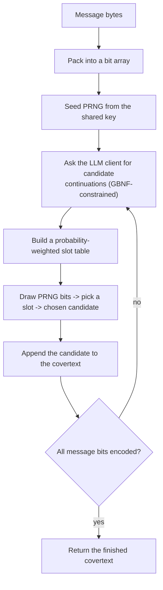
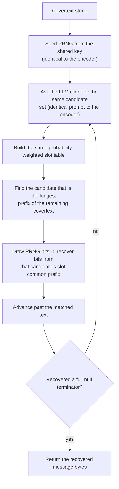
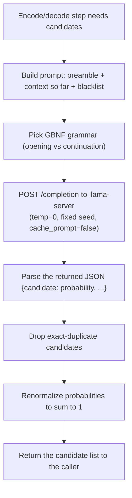

# doublespeak-c

A library for a coverless stegosystem that can embed binary data in an LLM generated text and recover it back, given a shared symmetric key. Inspired by Meteor papers (Kaptchuk et al., CCS 2021) but given a twist by embedding the data in syllable instead of whole words.

## Usage

### Latest releases

Pre-built binaries are published on the [GitHub releases page](https://github.com/yk001nul/doublespeak-c/releases) — grab the archive for your platform instead of building from source if you just want to run the tools.

- **Windows** releases ship the executable as an `.exe` file and the shared library as a `.dll` file (e.g. `doublespeak.exe`, `meteor.dll`).
- **Linux** releases ship the shared library as a `.so` file (e.g. `libmeteor.so`) and executables with **no file extension** (e.g. `doublespeak`), following standard ELF conventions.

### Command-line usage (`doublespeak`)

The `doublespeak` console app (`meteor_stego/apps/doublespeak.c`) exercises the library's encode/decode API directly from the command line:

```
doublespeak message [-f] [-d] context passphrase [style_index] [outputpath] [URL]
```

| Argument | Meaning |
|---|---|
| `message` | Text to encode, or (with `-f`) a filepath to read it from. Under `-d`, this is the covertext to decode instead. |
| `-f` | Treat `message` as a filepath and read its contents. |
| `-d` | Decode instead of encode (default: encode). |
| `context` | Mandatory. The shared starting context / topic both sides must agree on. |
| `passphrase` | Mandatory. Shared secret the library derives the encryption key from (via HKDF-SHA256). |
| `style_index` | Optional, `1`–`4` (default `1`). Selects the covertext style: `1` informal chat, `2` formal email, `3` casual blog, `4` news article. |
| `outputpath` | Optional. Write the result to this file instead of stdout. |
| `URL` | Optional. `llama-server` URL (default `http://127.0.0.1:8080`). |

`style_index`, `outputpath`, and `URL` are **strictly positional** — you can't supply `outputpath` without `style_index`, for example. Calling `doublespeak` with no arguments, or any malformed invocation, prints this usage guide and exits with a non-zero status.

Example:

```bash
doublespeak "hi" "The team meets on Friday." "a-shared-passphrase" 1 covertext.txt
doublespeak covertext.txt -f -d "The team meets on Friday." "a-shared-passphrase"
```

While encoding, `doublespeak` prints a rolling progress line to **stderr** after every step — elapsed time always, plus an estimated remaining time and finish-time-of-day once a step has actually recovered bits (there's no reliable way to predict total step count or per-step latency upfront, since both depend on the live LLM probability distributions at each step, not just message length — see `meteor_encode_ex()` in `meteor.h`). Stdout / `outputpath` stay clean either way, so piping or redirecting the actual result is unaffected.

### Python

The Python binding (`meteor_stego/bindings/python/meteor.py`) uses `ctypes` and auto-detects the shared library for the current OS — the same script works unmodified on Windows and Linux.

```python
import sys
sys.path.insert(0, "meteor_stego/bindings/python")
from meteor import Meteor

# On Windows this loads meteor.dll; on Linux, libmeteor.so — same Python code either way.
m = Meteor(key_input=b"a-shared-passphrase", salt=None)

covertext = m.encode(b"hi", starting_context="The team meets on Friday.")
print("covertext:", covertext)

recovered = m.decode(covertext, starting_context="The team meets on Friday.")
print("recovered:", recovered.decode())
```

### C#

The C# binding (`meteor_stego/bindings/csharp/Meteor.cs`) is a P/Invoke wrapper compatible with Godot 4's .NET runtime. `DllImport` resolves `"meteor"` to `meteor.dll` on Windows or `libmeteor.so` on Linux — no platform-specific code needed.

```csharp
using MeteorStego;
using System.Text;

// Identical code on Windows and Linux.
using var meteor = new Meteor(Encoding.UTF8.GetBytes("a-shared-passphrase"));

string covertext = meteor.Encode(Encoding.UTF8.GetBytes("hi"), "The team meets on Friday.");
Console.WriteLine($"covertext: {covertext}");

byte[] recovered = meteor.Decode(covertext, "The team meets on Friday.");
Console.WriteLine($"recovered: {Encoding.UTF8.GetString(recovered)}");
```

### C++

There's no dedicated C++ wrapper — `meteor.h` is a plain C header already guarded with `extern "C"`, so it can be included directly from C++.

```cpp
#include "meteor_stego/include/meteor.h"
#include <cstring>
#include <iostream>
#include <string>

int main() {
    const char* key   = "a-shared-passphrase";
    const char* topic = "The team meets on Friday.";

    MeteorConfig cfg{};
    cfg.key_input      = reinterpret_cast<const uint8_t*>(key);
    cfg.key_input_len  = std::strlen(key);
    cfg.beta           = 3;
    cfg.num_candidates = 8;
    cfg.llm_url        = "http://127.0.0.1:8080";
    cfg.max_steps      = 256;
    cfg.llm_timeout_ms = 30000;

    MeteorCtx* ctx = meteor_create(&cfg);

    int err = 0;
    char* covertext = meteor_encode(
        ctx, reinterpret_cast<const uint8_t*>("hi"), 2, topic, &err);
    std::cout << "covertext: " << covertext << "\n";

    size_t   rec_len   = 0;
    uint8_t* recovered = meteor_decode(ctx, covertext, topic, &rec_len, &err);
    std::cout << "recovered: "
              << std::string(reinterpret_cast<char*>(recovered), rec_len) << "\n";

    meteor_free(covertext);
    meteor_free(recovered);
    meteor_destroy(ctx);
}
```

- **Windows:** link against the `meteor.lib` import library generated alongside `meteor.dll`, and keep `meteor.dll` next to your executable (or on `PATH`).
- **Linux:** link with `-lmeteor -L/path/to/build`, and make sure `libmeteor.so` is on `LD_LIBRARY_PATH` (or embed an rpath) at runtime.

## Dependencies



- **libsodium** — provides the ChaCha20 CSPRNG (keyed via HKDF-SHA256) that drives every bit-selection decision. This is the cryptographic core of the whole scheme; a non-cryptographic PRNG here would break the security guarantees entirely.
- **cJSON** — parses the JSON candidate-probability objects `llama-server` returns from each `/completion` call. Vendored and built in-tree to avoid a compiler-flag clash with the rest of the project.
- **WinHTTP (Windows) / libcurl (Linux, macOS)** — the HTTP client used to talk to `llama-server`. WinHTTP is used on Windows purely because it ships with the OS and needs no extra install.
- **libhyphen** (optional) — real dictionary-based syllabification for the legacy (non-style) encode/decode path; a built-in heuristic is used if it's not linked in.
- **llama.cpp / `llama-server`** — the local LLM inference server. It's a separate OS process, not a linked library — the `meteor` library talks to it purely over HTTP, so it can run on the same machine or elsewhere on the network.

## Linguistic grammar (the Meteor algorithm)

Meteor ([Kaptchuk, Jois, Green & Rubin — *Meteor: Cryptographically Secure Steganography for Realistic Distributions*, ACM CCS 2021](https://eprint.iacr.org/2021/686)) encodes a secret message by replacing the language model's usual random sampling with pseudorandom bits derived from the message itself and a shared key. Each step, the model's candidate-probability distribution is carved into slots proportional to each candidate's probability; the pseudorandom-bit-selected slot decides which candidate gets emitted. Because slot width tracks probability, this behaves like Huffman coding: common (wide-slot) candidates yield few recovered bits per step, rare (narrow-slot) candidates yield more — the information-theoretic optimum. To anyone without the shared key, the output is indistinguishable from the model's ordinary text.

This project applies the idea at **syllable granularity** (rather than whole words) for the legacy encode/decode path, and at **phrase granularity** for the newer style-embellished path — both are the same core mechanism, just operating on a different candidate unit.



## Encoding

`meteor_encode()` (`meteor_stego/src/encode.c`) packs the message into a bit array, seeds the PRNG from the shared key, and then repeatedly: asks the LLM client for a set of candidate continuations, builds a probability-weighted slot table from them (`meteor_core.c`), draws pseudorandom bits to pick a slot, and appends the chosen candidate to the growing covertext — continuing until every message bit (plus a null terminator) has been encoded. In the newer style-embellished mode, a few extra per-step pseudorandom draws (not shown below) decide things like sentence boundaries and topic digressions, but they're the same "draw bits, pick a branch" pattern layered on top of the same core loop.



## Decoding

`meteor_decode()` (`meteor_stego/src/decode.c`) mirrors the encoder step for step: it re-derives the same PRNG stream from the shared key, and for each step asks the LLM client for the **identical** candidate set the encoder would have seen (same prompt, same context accumulated so far). Since the decoder doesn't know which candidate the encoder actually picked, it finds the longest candidate that's a textual prefix of the remaining covertext, then recovers bits from that candidate's slot the same way the encoder would have. This continues until the recovered bits contain a full null terminator, signalling the end of the message.



## The LLM / Llama server

### LLM client

`llm_client.c` is the only part of the library that talks to `llama-server`. For every encode/decode step it builds a prompt from a fixed style preamble, the covertext accumulated so far, and a rolling blacklist of recently-used words/phrases (to reduce repetition); picks the right GBNF grammar for the situation (an "opening" grammar for the start of a word/sentence versus a "continuation" grammar that forces a valid end-of-word/phrase marker); POSTs it to `llama-server`'s `/completion` endpoint with `temperature=0`, a fixed `seed`, and `cache_prompt=false` (disabling llama-server's default prompt-cache reuse, which was found to introduce server-state-dependent nondeterminism); then parses the returned JSON candidate/probability map, drops exact-duplicate keys, and renormalizes the probabilities to sum to 1.



### LLM server

`llama-server` is built from a pinned `llama.cpp` git tag via CMake's `ExternalProject_Add` (see `LLAMA_CPP_GIT_TAG` in `meteor_stego/CMakeLists.txt`):

```bash
cmake --build <build-dir> --target copy_llama_server
```

Then start it with a downloaded GGUF model:

```bash
# Linux / macOS
meteor_stego/out/build/<preset>/start_llama_server.sh /path/to/model.gguf

# Windows
meteor_stego\out\build\<preset>\start_llama_server.bat path\to\model.gguf
```

**The gotcha: the thread count is part of the shared protocol.** The encoder and decoder must derive *bit-identical* probability distributions at every step — a single differing bit anywhere corrupts the rest of the message with no error signal. Floating-point reduction order in matrix/attention math depends on how work is split across threads, so two machines using a *different* thread count can produce subtly different logits for the exact same prompt. llama.cpp's CPU backend is reproducible for a *fixed* thread count, so the start scripts read the `METEOR_NUM_THREADS` environment variable (default `1`, the safest cross-machine value) — raising it is a near-linear speedup (`4` validated at ~2.6× overall on Phi-3.5-mini), but **encoder and decoder must use the identical value**. The full determinism checklist (same GGUF file verified by SHA-256, `--temp 0.0 --seed 42`, CPU-only inference, `--no-mmap`, `--parallel 1 --no-cont-batching`, `cache_prompt=false`) is in `CLAUDE.md`.

Useful links:
- Prebuilt `llama-server` binaries: [llama.cpp releases](https://github.com/ggml-org/llama.cpp/releases)
- Browse GGUF-quantized models on Hugging Face: [huggingface.co/models?library=gguf](https://huggingface.co/models?library=gguf) — note that despite the "Llama" in `llama.cpp`'s name, the engine runs *any* GGUF model family (Llama, Phi, Qwen, Mistral, …), not just Meta's Llama models. This project is tested against **Phi-3.5-mini-instruct** (Q4_K_M quantization): [bartowski/Phi-3.5-mini-instruct-GGUF](https://huggingface.co/bartowski/Phi-3.5-mini-instruct-GGUF) — see `gguf-download.md` for the exact file, verified SHA-256, and download steps.

## Sample outputs

Real covertext samples from a verified encode/decode round trip, one per style, all recovering the original message (`hi`) exactly:

| Style | Topic (starting context) | Message | Covertext output |
|---|---|---|---|
| `INFORMAL_CHAT` | John goes to the office using his car every morning. | `hi` | he commutes by car to avoid stress to his workplace using a reliable vehicle to maintain punctuality with the department head. that to work with the client by starting the engine to avoid traffic with the exec team. |
| `NEWS_ARTICLE` | The government announced new policies to reduce carbon emissions by 2030. | `hi` | it introduces to avoid public criticism to the international conference by implementing renewable energy sources to enhance environmental sustainability with the environmental agency. they incorporate with the sustainability task force by investing in green infrastructure to avoid political unrest to meet the head of the green initiative. a new strategy in order to gain international approval through adopting wind farms. |
| `CASUAL_BLOG` | Sarah spent the whole weekend hiking in the mountains with her dog. | `hi` | he spent to avoid the noise of city traffic to the office building by carpooling to maintain a healthy routine with the department head. a modest transformation occurred to join the team by adopting a new schedule to avoid the congestion to join the project. their mountain retreat. |
| `FORMAL_EMAIL` | The team will present the quarterly results to stakeholders on Friday. | `hi` | the team is scheduled to to avoid the uncertainty of public transport schedules to the main branch through a prearranged meeting room to ensure timely attendance to meet the stakeholders. they implement with the department heads through a dedicated communication channel to avoid delays in transit with the project coordinators. the team presents to guarantee punctuality by setting reminders to meet the manager to ensure timely attendance to avoid public transport unpredictability. she prepares with the department heads. |

(The `FORMAL_EMAIL` sample's "to to" duplication is a known grammar/candidate-generation artifact — not a correctness bug, decoding still matches the covertext exactly via prefix matching. See `CLAUDE.md` for the full list of known non-blocking quality issues.)
